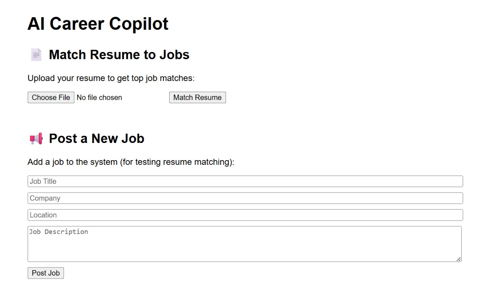
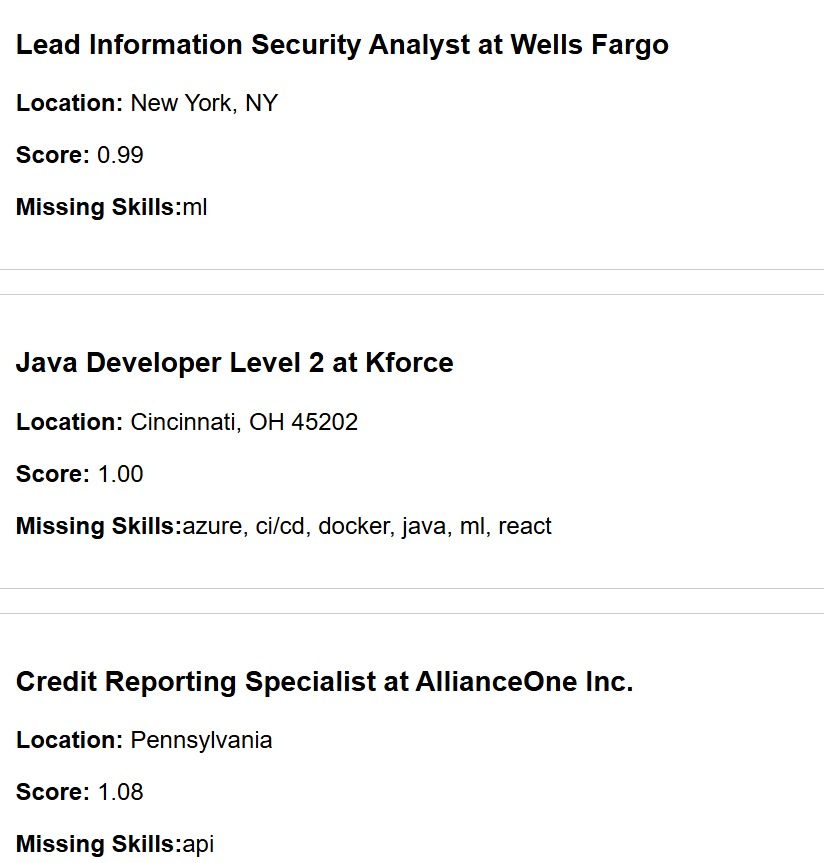

# AI Career Copilot
###  Smart Resume Matcher & Job Recommender 

A lightweight AI-powered tool that helps job seekers instantly match their resumes to relevant job roles based on skills, job descriptions, and semantic similarity. Built with FastAPI, React, and FAISS for real-time recommendations.

---

##  Overview

AI Career Copilot takes your resume, extracts the content using NLP, generates sentence embeddings, and recommends top-matching jobs from a job dataset using vector similarity search.

It demonstrates how job matching can be personalized using semantic embeddings — with a simple UI.

---

##  Features

-  Upload your resume 
-  Instantly get top 3 job matches
-  Match score + missing skill highlights
-  Post new job roles (optional)
-  Minimal UI, zero authentication

---

##  Tech Stack

- **Frontend**: React, Axios
- **Backend**: FastAPI, FAISS, PyMuPDF
- **ML/NLP**: `sentence-transformers/all-MiniLM-L6-v2`
- **Data**: CSV, SQLite (optional)
- **Deployment-ready**: Simple REST API & UI

---

##  Demo

### 🔹 Resume Upload and Match Results
<p align="center">
  
</p>

### 🔹 Top Job Matches
<p align="center">
  
</p>

---

##  Getting Started

### 1. Backend 

```bash
cd backend
python3 -m venv venv
source venv/bin/activate
pip install -r requirements.txt

# Build job index (only once)
python build_job_index.py

# Start FastAPI
uvicorn api.main:app --reload
```

### 2. Frontend

```bash
cd frontend
npm install
npm start
```

Backend: http://localhost:8000

Frontend: http://localhost:3000